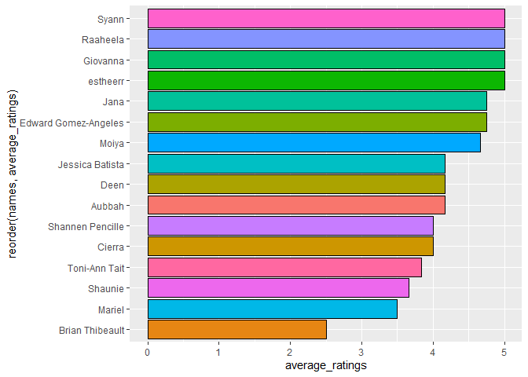
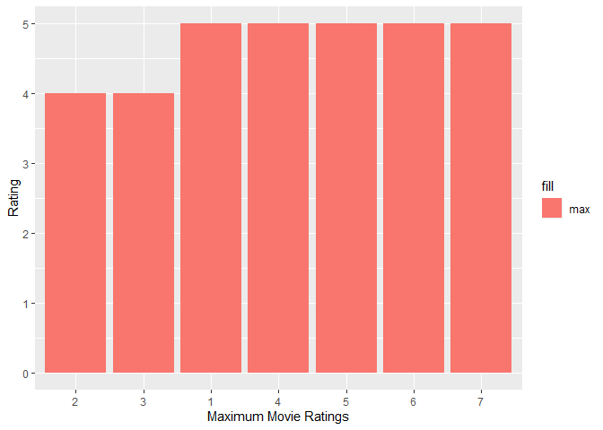
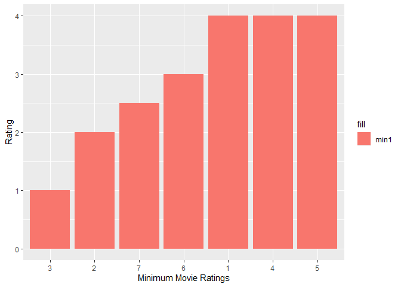

Homework 2
================
Moiya Josephs
2/9/2022

# Overview

For this assignment we were tasked with conducting a survey between our
friends on movies they have seen and how they rated them on a scale of 1
to 5 (1 being Very Poor, 5 being Awesome). I utilized Google Forms to
get the survey results and compiled it into a CSV. I then used that CSV
file to load data into a SQL table called **movie ratings**. The six
movies I surveryed were “Spider-Man No Way Home”, “The Matrix
Resurrectionist”, “Dune”, “Avengers Endgame”, “Encanto”, and “Sing2”.
All movies being relatively new and released in the past three years.

# Technology used

-   MySQL Workbench
-   RStudio
-   GitHub (version control)

# Hypothesis

The movie with the lowest rating will also be the movie with the lowest
performance, in-terms of mean score and the amount of viewers etc. In
comparison, the movie with the highest rating will be the movie with the
best performance.

Fundamentally the questions that will help prove or disprove this
hypothesis are:

-   Average Viewing score per person  
-   Average rating per movie  
-   Highest rating per movie, lowest rating per movie  
-   Most Viewed movie, least viewed movie

# SQL Code

First I needed to connect to the MySQL server with my user name and
password. The database name I will be using for this assignment is
called **movie_ratings**. I used system environment variables to access
my MYSQL database and called the connection con.

``` r
pw <- Sys.getenv("JDBC_PASSWORD")
con <- dbConnect(MySQL(), user='root', password=pw, dbname='movie_ratings', host='localhost')
```

While passing this connection I dropped the table I wanted to create in
case it already exists and created a new one with a name column, name
being the surveyed people and the movies, six in total.

``` sql
-- Make a movie rating database

drop table if exists movie_ratings;
```

``` sql
CREATE TABLE movie_ratings(
  names varchar(255),
  movie_1 int,
  movie_2 int,
  movie_3 int,
  movie_4 int,
  movie_5 int,
  movie_6 int
);
```

Then I loaded the data from the spreadsheet made from the results of the
Google form. I also made sure to include *ignore 1 lines* so that the
header is not also read in.

``` sql
LOAD DATA infile 'movie_ratings.csv'
INTO TABLE movie_ratings
FIELDS TERMINATED BY ',' 
ENCLOSED BY '"'
LINES TERMINATED BY '\r\n' ignore 1 LINES
(names,@movie_1,@movie_2,@movie_3,@movie_4,@movie_5,@movie_6)
SET
movie_1 = nullif(@movie_1,''),
movie_2 = nullif(@movie_2,''),
movie_3 = nullif(@movie_3,''),
movie_4 = nullif(@movie_4,''),
movie_5= nullif(@movie_5,''),
movie_6 = nullif(@movie_6,'');
```

Now with the table created and loaded with data, I created a data frame
in R with the same information. I did this by making a SQL code chunk
that selects all information in the table movie_ratings and making the
output variable a data frame that will also be called movie_ratings.

## Create data frame from the sql table

``` sql
select * from movie_ratings
```

``` r
head(movie_ratings)
```

    ##              names movie_1 movie_2 movie_3 movie_4 movie_5 movie_6
    ## 1         Raaheela       5      NA      NA       5      NA      NA
    ## 2            Moiya       5      NA      NA       5       4      NA
    ## 3            Syann       5      NA      NA       5      NA      NA
    ## 4    Toni-Ann Tait       5       3       1       5       5       4
    ## 5 Shannen Pencille       5       2       2       5       5       5
    ## 6             Deen       4       3       4       5       4       5

# Data Analysis

The column names in the table are then changed to the actual movie names
so that I can understand the data more.

``` r
names(movie_ratings)[names(movie_ratings) == "movie_1"] <-  "Spider-Man No Way Home"
names(movie_ratings)[names(movie_ratings)== "movie_2"]<- "The Matrix Resurrectionist"
names(movie_ratings)[names(movie_ratings) == "movie_3"] <- "Dune"
names(movie_ratings)[names(movie_ratings)=="movie_4"] <- "Endgame" 
names(movie_ratings)[names(movie_ratings) == "movie_5"] <- "Encanto"
names(movie_ratings)[names(movie_ratings)=="movie_6"]<-  "Sing 2"
```

## Average rating per person

First, I made an additional column that averages the movie ratings per
person and plotted it on a bar plot. I made sure to sort it so it is
clear to see the here everyone stands. The people with the highest
rating was Syann, Raaheela, Giovanna, and Estheerr and the person with
the least was Brian.

``` r
movie_ratings$average_ratings <- rowMeans(movie_ratings[ ,c(2,3,4,5,6,7)],na.rm=TRUE)
ggplot(movie_ratings, aes(x=reorder(names,average_ratings), y=average_ratings, fill=names)) +
  geom_bar(position=position_dodge(), stat="identity",
           colour='black') + coord_flip() + theme(legend.position="none")
```

<!-- -->

## Find the average, min and max per movie

Now to get some more statistics and verify my hypotheses I was
interested in the mean, maximum and the minimum for each movie.

### Find the mean rating per movie

To find the mean of each movie I used the summarize_if function in dyplr
making sure to note that some values may be NA.

``` r
movie_avg <- movie_ratings %>% summarise_if(is.numeric, mean, na.rm=TRUE)
movie_avg
```

    ##   Spider-Man No Way Home The Matrix Resurrectionist  Dune  Endgame  Encanto
    ## 1                    4.8                          3 2.375 4.785714 4.692308
    ##   Sing 2 average_ratings
    ## 1    4.1        4.260417

The mean for each movie as noted in the table above shows that the movie
Spider-Man No Way Home achieved the highey minumum score of 4.8. The
lowest rated movie was Dune which received 2.375.

### Find the maximum rating per movie

Next I wanted to find each movies respective maximum score. As noted in
the table below Spider-Man, Endgame, Encanto and Sing all received a
maximum rating from the survey.

``` r
movie_max <- movie_ratings %>% summarise_if(is.numeric, max, na.rm=TRUE)
movie_max
```

    ##   Spider-Man No Way Home The Matrix Resurrectionist Dune Endgame Encanto Sing 2
    ## 1                      5                          4    4       5       5      5
    ##   average_ratings
    ## 1               5

``` r
movies_max_graph <- as.numeric(movie_max[1,])

names(movies_max_graph)<- c("Spider-Man No Way Home", "The Matrix Resurrectionist", "Dune", "Avengers Endgame", "Encanto", "Sing2", "average")

ggplot() + geom_bar(aes(x=reorder(seq_along(movies_max_graph),movies_max_graph),y=movies_max_graph, fill="max"), stat='identity') + xlab('Maximum Movie Ratings') + ylab('Rating')
```

<!-- -->

For a more graphical output I plotted the maximums again. This way it is
clear to see a majority of the movies were highly rated by at least one
person.

### Find the minimum rating per movie

Finally, to compute the minimum value I used the same methods as before.

``` r
movie_min <- movie_ratings %>% summarise_if(is.numeric, min, na.rm=TRUE)
movie_min
```

    ##   Spider-Man No Way Home The Matrix Resurrectionist Dune Endgame Encanto Sing 2
    ## 1                      4                          2    1       4       4      3
    ##   average_ratings
    ## 1             2.5

Here we can see the minimum values that each movie received. The show
which received the lowest minimum was Dune which received a rating of 1.
Spider-Man(movie 1), Encanto (movie 5) and Endgame (movie 4) all
received 4 as their minimum score, which is still very high.

To view it visually, I took the data frame and made it into a vector.
Next, I used ggplot to graph all the minimum scores for each movie.

``` r
min1 <- as.numeric(movie_min[1,])

names(min1)<- c("Spider-Man No Way Home", "The Matrix Resurrectionist", "Dune", "Avengers Endgame", "Encanto", "Sing2", "average")

ggplot() + geom_bar(aes(x=reorder(seq_along(min1),min1),y=min1, fill="min1"), stat='identity') + xlab('Minimum Movie Ratings') + ylab('Rating')
```

<!-- -->

Again you can view at least three movies having a high minimum and the
movie we know to be Dune(movie 3) to have a minimum score of 1. Spider
Man(movie 1) and Avengers(movie 4) continue to out perform the other
movies in terms of ratings.

## Most Viewed vs least viewed

Next I wanted to see which movies were the least seen versus the most
seen. Not every person surveyed saw each movie listed, this can
influence mean scores. To achieve this I simply counted any ratings that
were not missing in a given column.

``` r
colSums(!is.na(movie_ratings[2:7]))
```

    ##     Spider-Man No Way Home The Matrix Resurrectionist 
    ##                         15                          9 
    ##                       Dune                    Endgame 
    ##                          8                         14 
    ##                    Encanto                     Sing 2 
    ##                         13                         10

The most viewed movie is Spider man No Way Home, which is pretty popular
right now. Endgame being the second viewed, Encanto and then Sing 2.

# Conclusion

In conclusion, the most viewed movie is Spiderman, which also achieved
the highest mean, minimum and maximum score. The least viewed movie is
Dune, which while it did receive a score of 4 it also received a minimum
score of 1. Dune had the widest range in terms of ratings. In my small
survey I can safely say Spiderman is a crowd favorite while Dune is an
acquired taste. This data suggests my initial hypothesis was correct,
the most viewed movies performed the best in terms of ratings while the
least viewed movie performed the worst.
